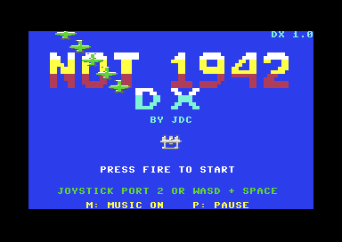
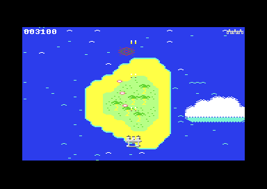
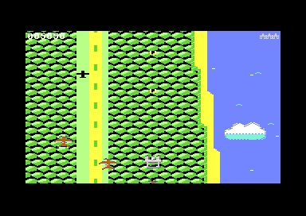
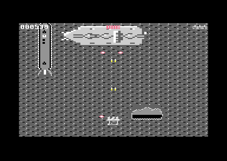
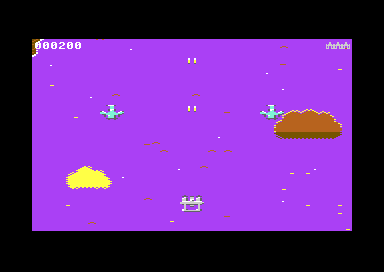
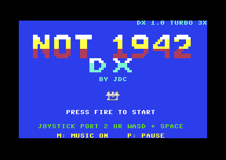

# NOT 1942 DX

*by JDC · version DX 1.0*

A vertically scrolling shoot-'em-up for the **Commodore 64**, written from scratch in 6502 assembly. **NOT 1942 DX** is the deluxe remake of **NOT 1942**, inspired by the arcade classic *1942*. It keeps the original game: four levels, four bosses, the music and the controls. The engine and all the graphics are new.

<p>
  
  
</p>
<p>
  
  
</p>

More in [`screenshots/`](screenshots).

## The game

Fly a twin-boom fighter across four battlegrounds against squadrons that fly in formation:

- Fighters in V's, echelons and strings that dive, swoop, loop and zig-zag
- Leaders with wingmen, and gunships that hover and fire aimed shots
- Raiders that climb up from behind you
- Dive bombers, and enemy aces in their own fast fighters
- Red leaders that drop **gold medals** worth 500 points when shot down

You have three lives, one hit kills, and a short blinking invulnerability after each respawn. Each level scrolls for about a minute and a half, then ends in a boss fight with a health bar and two attack phases.

| Level | Landscape | Boss |
|---|---|---|
| 1. Open Ocean | Tropical islands, rolling surf, drifting clouds | *Thunder*, a four-engine bomber |
| 2. Jungle Coast | A jungle shore with rivers, a village and an enemy airstrip | *Leviathan*, an armoured airship |
| 3. Sunset Strait | A winding strait between cliffs, boats, gun pits and a lighthouse | *Albatross*, a giant flying boat |
| 4. Enemy Fleet | Destroyers, cruisers and carriers on a storm-grey sea | *Kraken*, the enemy flagship |

Beat all four for the ending.

## What's new in DX

- Smooth scrolling, one pixel every frame, over the whole screen, with colour RAM that scrolls too
- A sprite multiplexer: up to 18 sprites on screen at once (the original had 8)
- Redrawn levels with animated water and surf, clouds, and in level 4 a sea that moves past the ships
- New planes, and bigger bosses (up to 144×84 pixels) with longer fights
- Multi-stage explosions, screen shake, and fades between levels
- A floating sprite HUD, so the whole screen is playfield
- An air show of formations on the title screen, and fireworks for the ending
- Keys 1-4 on the title screen jump straight to that level's boss, for practice

Original 3-voice SID music (a title song, a theme for each level and a boss theme), with sound effects mixed in. It runs on a stock **PAL** C64 at 1 MHz. NTSC isn't supported.

## Controls

| Input | Action |
|---|---|
| Joystick in port 2 | Move and fire |
| W A S D, Space | Move, fire |
| P or RUN/STOP | Pause and resume |
| M (title screen) | Music on or off |
| 1-4 (title screen) | Go straight to that level's boss |

## Playing it

Build the release files (see below), then use whichever suits you:

- **Disk image** `build/not1942dx.d64`: on a real C64 or in an emulator such as VICE:
  ```
  LOAD"NOT 1942 DX",8,1
  RUN
  ```
  About a minute on a stock 1541; a fast loader makes it much shorter.
- **Program file** `build/not1942dx.prg`: the same game, for emulators that start a PRG directly.
- **Cartridge image** `build/not1942dx.crt` (Magic Desk): attach it or flash it to a cartridge, and the game starts at power-on with no loading.

### MiSTer turbo version

A second build is made for the **MiSTer** FPGA's C64 core. It uses the core's turbo mode for a harder game:
- about 120-136 enemies a level instead of 83-96, up to seven planes at a time
- bosses with bullet patterns: sweeping fans and aimed bursts
- more enemy fire on screen
- clouds drifting over everything at twice the speed of the land below

<p>
  
  
</p>

Set **Turbo mode** to **C128** or **Smart** and **Turbo speed** to 2x, 3x or 4x in the OSD (F12). The game checks at start-up: with turbo off it says what to set, and starts by itself once turbo is on. The title shows the speed it found. It isn't for a real C128, whose graphics chip shows no picture at 2 MHz: it says so and asks for the standard version. The files are `build/not1942dx-turbo.d64`, `.prg` and `.crt`; load the disk with `LOAD"NOT 1942 DX T",8,1`.

## Building

You need [ACME](https://sourceforge.net/projects/acme-crossass/) 0.97, [VICE](https://vice-emu.sourceforge.io/) (`x64sc`, `c1541`), [Exomizer](https://bitbucket.org/magli143/exomizer/wiki/Home) 3.1.2 and Python 3 with Pillow. On macOS:

```bash
brew install acme vice exomizer
pip3 install pillow
```

Then:

```bash
make            # build/not1942dx-dev.prg, uncompressed, with symbols and a listing
make run        # run it in VICE (x64sc, PAL)
make release    # what ships: the compressed .prg, the .d64 and the .crt
make turbo      # the MiSTer turbo build: build/not1942dx-turbo.{prg,d64,crt}
make run-turbo  # the turbo build in VICE's SuperCPU emulator (xscpu64)
make DEBUG=1 run  # with a border bar showing the time each frame takes
make clean
```

The level pictures are turned into packed data at build time, so a fresh checkout needs nothing but the tools above.

To make a release archive, run `./release.sh`. It builds both versions from clean and checks each compressed program against its uncompressed build. It then writes `dist/not1942dx-<version>.zip` with the disk, program and cartridge files, the README, the licence and checksums. `./release.sh --publish` also creates the GitHub release.

## How it's put together

| Path | What's there |
|---|---|
| `src/` | The game, in 6502 assembly. `main.asm` is the only entry point; `crt.asm` wraps the finished game in a cartridge image |
| `data/` | Levels, waves, enemy paths, bosses, sprites, music, sound effects, title and ending |
| `data/levels/` | Each level as a PNG picture with a JSON file of its colours, boss row and animations |
| `tools/` | Python tools: `png2level.py`, `png2sprites.py`, and the checkers `check_waves.py`, `check_map.py` and `profile.py` |
| `tools/art/` | The scripts that drew the level pictures and the turbo build's cloud |
| `screenshots/` | Screenshots of the whole game |
| `PLAN.md` | The plan the remake was built to, milestone by milestone |
| `BUDGET.MD` | Measured CPU, memory and data budgets, and how to re-measure them |
| `MISTER-TEST.md` | The checklist for testing the turbo build on a MiSTer |

A few engine notes:

- **Scrolling:** a coarse character-row step every 8 frames flips between two screen buffers. The back buffer is built a slice at a time on the frames in between, and on the flip frame colour RAM is copied just behind the raster.
- **Levels:** each level is a picture, cut into up to 192 unique characters, with an LZ-packed character map that's unpacked a row at a time as it scrolls in.
- **Sprites:** game code writes virtual sprite slots. The multiplexer sorts them by Y every frame and reuses the 8 hardware sprites with raster interrupts.
- **Collisions** are software box tests.
- **Data checks:** waves, paths, music and boss scripts are written with ACME macros that check the data while it assembles. `tools/check_waves.py` replays every enemy path to check the sprite budget.

## Licence

[GNU General Public License v3.0](LICENSE).
